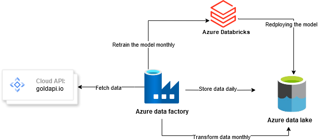

## Pipeline Overview  

This MLOps pipeline automated the process in the project of gold price forecasting by integrating data extraction, transformation, and model retraining. It leverages Azure Data Lake, Azure DataBricks Notebooks to streamline data ingestion, preprocessing, and model updates.  

### Pipeline Architecture  

  

The pipeline consists of the following key stages:  

### 1) Fetching Data (Data Ingestion)  
 **Objective:** Collect real-time gold price data and store it in Azure Data Lake for further processing.  

- Data is fetched from **goldapi.io API** providing historical and real-time gold price updates.  
- The data is stored in CSV format in **Azure Data Lake Storage (ADLS)** under the **"raw-data"** folder.  
- The notebook `fetching_data.ipynb` handles this process using Python libraries like `requests` and `pandas`.  

---

### 2) Transforming Data (Feature Engineering & Preprocessing)  
 **Objective:** Clean and transform raw data to prepare it for training a forecasting model.  

- Load raw data from Azure Data Lake into a **Databricks Notebook**.  
- Perform **data cleaning** (handling missing values, duplicate removal, and type conversions).  
- Extract **new features** such as moving averages, trend indicators, and volatility metrics.  
- Store the processed data in the **"ready-transformed-data"** folder in Azure Data Lake.  
- The notebook `transforming_data.ipynb` implements this phase.
- 
---

### 3) Model Retraining & Deployment  
 **Objective:** Retrain our machine learning model to improve gold price forecasting based on new data.  

- Load transformed data from Azure Data Lake into a **Azure Databricks Notebook**.  
- Retrain our model and restore it to Azure data lake as a serialized file (`.pkl`).  
- The notebook `model_retraining.ipynb` handles this phase.  
